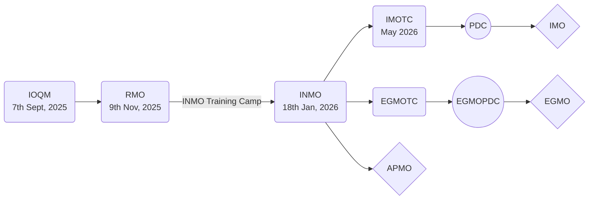

# Mathematical Olympiad program in India

The [Homi Bhabha Centre for Science Education](https://olympiads.hbcse.tifr.res.in/) (HBCSE) organizes the [Math Olympiad program](https://olympiads.hbcse.tifr.res.in/mathematical-olympiad-2025-2026/) in India. 

##### The [Math Olympiad program organized by HBCSE](https://olympiads.hbcse.tifr.res.in/wp-content/uploads/2023/12/brochure-maths-Olympiad-2023-24.pdf), is the  only one  leading to participation in the following  International  Mathematical Olympiads.

- [International Mathematical Olympiad](https://www.imo-official.org/) (IMO)
- [European Girls’ Mathematical Olympiad](https://www.egmo.org/) (EGMO)
- [Asian Pacific Mathematics Olympiad](https://www.apmo-official.org/) (APMO)

<!--  IMO, APMO, EGMO.  -->

####  No other contests are recognized. 

## [Eligibility](https://olympiads.hbcse.tifr.res.in/how-to-participate/eligibility/mathematical-olympiad/)
> - The students enrolled in the 8th, 9th, 10th, 11th or 12th standard may participate in IOQM, provided certain additional conditions are met. The precise details are available at the [webpage](https://olympiads.hbcse.tifr.res.in/) of the Homi Bhabha Centre for Science Education (HBCSE). Please visit [this webpage](https://olympiads.hbcse.tifr.res.in/mathematical-olympiad-2025-2026/) for the updates and further details.
{: .block-tip }

## Some [stages](https://olympiads.hbcse.tifr.res.in/about-olympiads/stages/mathematical-olympiad/) of the Math Olympiad program 2025 --- 2026

<!-- https://mermaid.js.org/syntax/examples  -->





### IOQM (Indian Olympiad Qualifier in Mathematics)

- Scheduled on [7th September, 2025](https://olympiads.hbcse.tifr.res.in/mathematical-olympiad-2025-2026/).
- The paper consists of 30 questions worth 100 marks in total. 
- There are 10 questions worth 2 marks, 10 questions worth 3 marks, 10 questions worth 5 marks.
- Websites: [MTAI](https://www.mtai.org.in), [HBCSE](https://olympiads.hbcse.tifr.res.in/mathematical-olympiad-2025-2026/).
- A few problems from IOQM 2023 have been discussed [here]({{ site.url }}{{ site.baseurl }}/blog/2024/IOQM/).





### RMO (Regional Mathematical Olympiad)

- Scheduled on [9th November, 2025](https://olympiads.hbcse.tifr.res.in/mathematical-olympiad-2025-2026/).
- The paper consists of 6 questions.
- It requires writing detailed proofs.
- Websites: [HBCSE](https://olympiads.hbcse.tifr.res.in/mathematical-olympiad-2025-2026/).
- The result of RMO 2024 may be found at [this link](https://olympiads.hbcse.tifr.res.in/rmo-2024-results/).





##### INMOTC (Indian National Mathematical Olympiad Training Camp)

- The schedule of the INMO Training Camps, to be held prior to INMO 2026. <!--, may be found at [this link](https://olympiads.hbcse.tifr.res.in/rmo-2024-results/). -->
- The INMO Training Camp 2025 for the Madhya Pradesh region was held from 09.01.2025 to 12.01.2025 at IISER Bhopal. Details may be found at [this page]({{ site.url }}{{ site.baseurl }}/INMOTC25MP/).





### INMO (Indian National Mathematical Olympiad)

- Scheduled on [18th January, 2026](https://olympiads.hbcse.tifr.res.in/mathematical-olympiad-2025-2026/).
- The paper consists of 6 questions.
- It requires writing detailed proofs.
- Websites: [HBCSE](https://olympiads.hbcse.tifr.res.in/mathematical-olympiad-2025-2026/).





### IMOTC (International Mathematical Olympiad Training Camp)

- About a month-long training camp, held usually in May.
- Through the TSTs ([Team Selection Tests](https://artofproblemsolving.com/community/c3310_india_imo_training_camp)), it leads to the selection of six students to represent India at [IMO](https://www.imo-official.org/organizers.aspx).
- Websites: [HBCSE](https://olympiads.hbcse.tifr.res.in/mathematical-olympiad-2025-2026/).





### PDC (Pre-Departure Camp)

- Held before leaving for [IMO](https://www.imo-official.org).
- Websites: [HBCSE](https://olympiads.hbcse.tifr.res.in/mathematical-olympiad-2025-2026/).





##### Past Question papers

The past papers are available at the webpages of
- [ISI, Kolkata](https://www2.isical.ac.in/~rmo/resources.html),
- [HBCSE](https://olympiads.hbcse.tifr.res.in/how-to-prepare/past-papers/),
- [HBCSE](https://library.hbcse.tifr.res.in/olympiads/subjects/mathematics/previous-question-papers-and-solutions),
- [HBCSE](https://library.hbcse.tifr.res.in/olympiads/uploads).

> The links to the past Question papers along with [AoPS](https://artofproblemsolving.com/community/c3176_india_contests) links are available at [this page]({{ site.url }}{{ site.baseurl }}/PastPapers/).





---

> - For [EGMO](https://www.egmo.org/), the stages are IOQM, RMO, INMO, EGMOTC, EGMOPDC, EGMO (along with certain criteria at the stages).
> - For [APMO](https://www.apmo-official.org/), the stages are IOQM, RMO, INMO, APMO (along with certain criteria at the stages).
{: .block-tip }

> - [INMOTC](https://olympiads.hbcse.tifr.res.in/faq/) is a camp, organized before INMO.
{: .block-tip }
